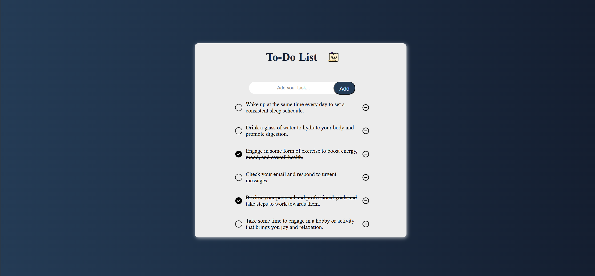

# Todo List Application

A minimalist, persistent todo list built with vanilla JavaScript, featuring local storage and interactive UI elements.

## Live Demo

[View Live Demo](https://Khosrow-hub.github.io/todo-list/)

## Features

- Task Management: Add, complete, and delete tasks
- Local Storage: Tasks persist between browser sessions
- Interactive UI:
  - Visual feedback on hover states
  - Check/uncheck animations
  - Responsive design
- Form Validation: Prevents empty task submission

## Technologies Used

- HTML5
- CSS3 (Flexbox, CSS Grid, Custom Properties)
- Vanilla JavaScript (ES6+)
- Browser LocalStorage API

## Project Structure
todo-localstorage-js/
├── index.html              # Main HTML document
├── style.css               # Styles and responsive layout
├── index.js                # Application logic and localStorage
├── images/                 # UI icons and assets
│   ├── to-do-list.png      # Header icon
│   ├── dry-clean.png       # Unchecked task icon
│   ├── check.png           # Checked task icon
│   ├── remove.png          # Delete icon (normal)
│   ├── remove2.png         # Delete icon (hover state)
│   └── screenshot_app.png  # Application screenshot
├── README.md               # This documentation
├── .gitignore              # Ignored files (node_modules, logs)
└── LICENSE                 # MIT License

